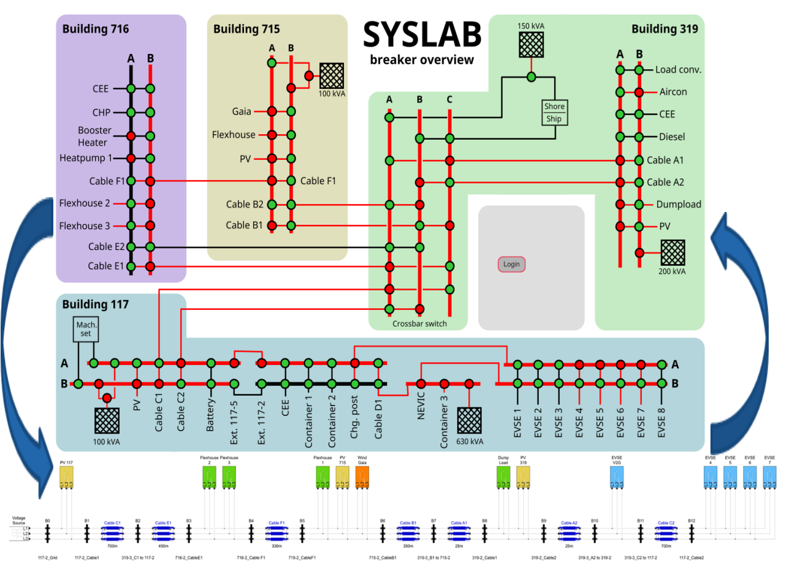

# VEHICLE is an repository of the project Validation of bEnchmark system for cHargIng ControL invEstigation
Four validated grid topologies are designed and validated via physical field mesaurments

Author: Artjoms Obusevs (A.Obusev@gmail.com)
Co-author: - Alexander Mächler 
           - Roger Glarner 

The open-source low-voltage grid reference system is designed for the MATLAB Simulink environment and incorporate both non-controllable and controllable components, such as PVs, HPs, boilers and EVs. As the controllable components are still in development, these will be investigated in subsequent research. Solely the non-controllable components were imple-mented to construct various low-voltage topologies combined with different load/generation scenarios. These scenarios, also called cases, were then investigated, verified and validated by running them in a real-time environment in an OPAL-RT setup. The simulation results ex-tracted from the Simulink OPAL-RT system were then validated by comparing them to real-field measurement data which were obtained during two visits at SYSLAB, DTU Risø Cam-pus, in Denmark (February April/May 2022) as part of the ‘VEHICLE’ ERIGRID 2.0 project. In other words, a physical exchange was conducted to implement predefined low-voltage topologies in the physical adjustable low-voltage grid at SYSLAB DTU, with which various tests were conducted in order to acquire real-field measurements in high resolution (e.g. 1 second values of U, I, P, Q).

[IRED_Poster_2022](img/2022_10_IRED_Poster_A0_ISGAN-SIRFN_T4_PST-VEHICLE_v1.1.pdf)
